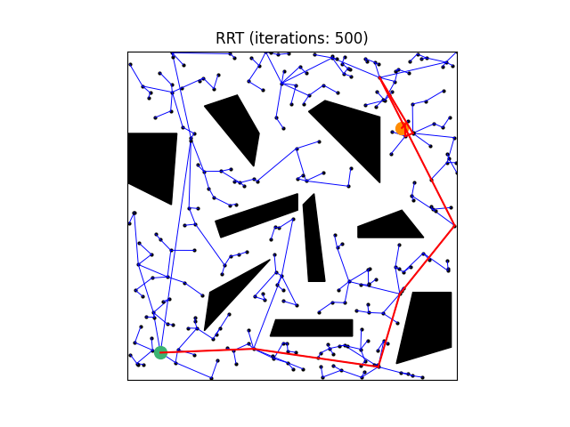

# RO47005 PDM Project - Group 5

## Introduction
This repository contains the source code used for the PDM project of group 5. The goal of the project is to plan the motion of a car (represented by the kinematic bicycle model) from a set starting pose to a set goal pose. The simulation of the car is validated in a dynamic environment, where the RRT* (with Dubins) is used as global planner and the velocity obstacle method is used as local planner for avoiding the dynamic obstacles.

## Contribution of others
- The creation of the [Dubins](https://github.com/FelicienC/RRT-Dubins/blob/master/code/dubins.py) paths (`src/dubins.py`)
- The [kinematic bicycle model](https://github.com/winstxnhdw/KinematicBicycleModel/blob/main/kinematic_model.py) (`src/kinematic_model.py`)
- The [stanley controller](https://github.com/winstxnhdw/FullStanleyController/blob/master/stanley_controller.py) for path tracking of the car (`src/stanley_controller.py`)
- The [simulation](https://github.com/winstxnhdw/KinematicBicycleModel/blob/main/animate.py) of the car (`src/simulation.py`)

## Our contribution
- Implementation of various RRT planners:
   - RRT planner with standard connector function (`src/RRT.py`)
   - RRT* planner with standard connector function (`src/RRT_Star.py`)
   - RRT planner with Dubins connector function (`src/RRT_Dubins.py`)
   - RRT* planner with Dubins connector function (`src/RRT_Star_Dubins.py`)
- Created a basic GUI using tkinter for creating 2D-environments with polygonal obstacles (`src/create_environment.py` & `src/create_polygons.py`)
- Collision detection of polygonal obstacles based on [Polygon/Point](https://www.jeffreythompson.org/collision-detection/poly-point.php) (`src/collision_detection.py`)
- Implementation of velocity obstacle (`src/VelocityObstacle.py`)
- Combined everything into a simulation (`src/simulation.py`) showing the global and local planner in work

## How to use
1) Clone the repository in a directory of choice:

```terminal
git clone https://github.com/levijn/RO47005-PDM
```

2) Create a virtual environment (optional but recommended):
```terminal
python -m venv venv
```
3) Activate virtual environment:
```terminal
.\venv\Scripts\activate
```

4) Install the required dependencies:

```terminal
pip install -r requirements.txt
```

## Run instructions
All commands below have to be executed within the root directory (RO47005-PDM).

### Environment creator
The environment or map can be created using the command below:

```terminal
python src/create_environment.py
```

<p float="left">
  
  
</p>

It initializes a tkinter canvas window (left image), in which three options are presented:
1) You can draw lines and connect them to create polygonal obstacles.
2) You can place the start pose by clicking the `Place Start` button; the position will be first placed and then the orientation.
3) You can place the goal pose by clicking the `Place Goal` button; the position will be first placed and then the orientation.

When finalized the map can be saved by clicking the button `Stop and Save Environment`. The current settings will scale down the created environment to a map (right image) size of 60x60 (scaling can be changed in source code). And it will store the created map as JSON file in the folder maps. The map (map_name.json) is acessible by using the `load_environment(map_name)` function defined in `create_environment.py`.

### Global planners
The run instructions for the four created path planners (RRT, RRT*, RRT with Dubins, RRT* with Dubins) can be found below. For the final simulation and evaluation of the motion planning of the car, the RRT* with Dubins was selected as planner. Each planner below has a set max iterations of 500. For the planners RRT and RRT with Dubins a node is placed at the goal location at iterations = 450 to ensure that the path is found within the max iterations. For the planners RRT* and RRT* with Dubins, a node is also sampled at the goal location after 50 iterations to enforce that the optimal path to the goal gets recalculated.

The start location of the car is depicted by the green circle, whilst the goal location is depicted by the orange circle. The black polygonal objects represent the static obstacles. The red line represents the 'best' path that has been currently found by the planner after a certain amount of iterations.

#### RRT

```terminal
python src/RRT.py
```

<p align="center">
  
</p>

#### RRT* 

```terminal
python src/RRT_Star.py
```

<p align="center">
  
</p>

#### RRT Dubins

```terminal
python src/RRT_Dubins.py
```

<p align="center">
  
</p>

#### RRT* Dubins

```terminal
python src/RRT_Star_Dubins.py
```

<p align="center">
  
</p>

### Local planner
The local planner is a simple velocity obstacle algorithm that does not change its trajectory, but instead slows down or speeds up depending on the dynamic obstacles.

```terminal
python src/VelocityObstacle.py
```

<p float="left">
  
</p>

### Simulation
The simulation combines all the elemements of the global and local planner together. Furthermore, it also uses the kinematic bicycle model and the stanley controller for following the generated reference path.

```terminal
python src/simulation.py
```

<p float="left">
  
</p>

## Future work
For future work, the following can be worked on:
- Extending the velocity obstacle algorithm to be able to change the current trajectory.
- Or work on other possible local planners: e.g., Reciprocal Velocity Obstacles, or NH-ORCA algorithms.
- Rewriting / Implementing the code in C++ to improve computational efficiency.
- Using a more advanced (3D) simulation environment, e.g., [gym_envs_urdf](https://github.com/maxspahn/gym_envs_urdf).
- Enhance motion planning with dynamic bicycle model, more realistic constraints, and environmental factors.
  
